සක්වළ · A complete world-system.

Sakwala holds all software and AI engineering work by Seevali under one sky. 
Every project is a named body in orbit around the same center. 
The system grows. The geometry holds.

Sakwala is a one-person studio.

[SAKWALA.DEV](https://sakwala.dev) · [BY SEEVALI](https://seevali.dev)

## THE ORBITS

- `SKW-01` · `IN ORBIT` · [Affiant](https://sakwala.dev/products/affiant/) — Sworn provenance for every AI write.
- `SKW-02` · `FORMING` · [InFrame](https://sakwala.dev/products/inframe/) — Auto-framing for the cameras Windows left behind.
- `SKW-03` · `IN ORBIT` · [Ergane](https://sakwala.dev/products/ergane/) — An autonomous build loop. Specs in, reviewed commits out.
- `SKW-04` · `ACTIVE` · [Moneta](https://sakwala.dev/products/moneta/) — The household ledger and the tax law, over chat.
- `SKW-05` · `FORMING` · [Aoede Studio](https://sakwala.dev/products/aoede-studio/) — The studio where an agent makes the films.

`SKW-nn` — the designation, frozen once assigned. `IN ORBIT` — public. `ACTIVE` — released, by invitation. `FORMING` — being built. Each name links to its catalog entry on sakwala.dev.

## THE REPOSITORIES

- [affiant](https://github.com/Sakwala/affiant) — the .NET framework. Ten packages on NuGet at `1.0.0-beta.3`, with adapters for Semantic Kernel, Microsoft Agent Framework and Microsoft.Extensions.AI.
- [affiant-protocol](https://github.com/Sakwala/affiant-protocol) — the rulebook: wire schemas, numbered invariants, and the conformance suite every implementation is held to.
- [affiant-ts](https://github.com/Sakwala/affiant-ts) — the TypeScript implementation, held to the same rulebook.
- [ergane](https://github.com/Sakwala/ergane) — GitHub issues or an epic file go in; reviewed, committed code comes out one story at a time, each in a fresh agent session.

Site, demos and roadmap at [affiant.dev](https://affiant.dev). Affiant is pre-1.0; expect the API to move between prerelease tags. The Affiant repositories are Apache-2.0; Ergane is MIT. Issues and pull requests go to the repository they concern; everything else to [hello@sakwala.dev](mailto:hello@sakwala.dev).

The name and mark come from the Sakwala Chakraya — a chart cut into granite near Anuradhapura, Sri Lanka, conventionally dated to around the seventh century and read since 1911 as a map of the worlds. [THE STONE BEHIND THE NAME →](https://sakwala.dev/chakraya/) One mark, carved twice. Once in stone. Once in code.

The Sakwala name and marks are Seevali's. The code is under the licences named in THE REPOSITORIES.

